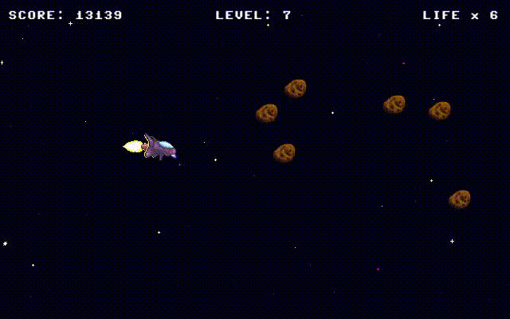

# KILLER ASTEROIDS PS I have no fucking clue how to run this on windows hence this fork will be deleted as fuck xD

> Shoot 'em up game created with pygame

[](https://www.pygame.org/)
[](https://opensource.org/licenses/MIT)
[](https://github.com/psf/black)



A simple 2D game written in Python with [pygame](https://www.pygame.org/).

## Setup

#### Create virtual environment

```sh
python -m venv [directory name]
```
```sh
source [directory name]/bin/activate
```

#### Install package & requirements

```sh
pip install . -r requirements.txt
```

Or install in editable mode:

```sh
pip install -e . -r requirements.txt
```

#### uninstall package & requirements

```sh
pip uninstall killerasteroids -r requirements.txt
```

## Usage

Start game by typing `killerasteroids` in the terminal.

#### Controls

| Key | Description |
|--|--|
| `P` | Pause game |
| `Esc` | Quit game |
| `Enter` | Activate option in menu |
| `Space` | Fire weapon |
| `Backspace` | Go back in menu |
| `↑` `↓` `←` `→` | Control the spaceship |

## Run tests

```sh
python -m unittest -v
```
